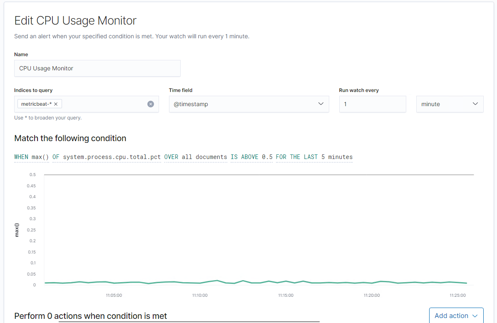

# Blue Team: Summary of Operations

## Table of Contents
- Network Topology
- Description of Targets
- Monitoring the Targets
- Patterns of Traffic & Behavior
- Suggestions for Going Further

### Network Topology
_TODO: Fill out the information below._

The following machines were identified on the network:
- Target 1
  - **Operating System**:Linux
  - **Purpose**:Test for vulnerability
  - **IP Address**:192.168.1.110

- Target 2
  - **Operating System**:Linux 
  - **Purpose**:Linux Test vulnerabilty
  - **IP Address**:192.168.115

 - Kail 3
    - **Operating System**:Linux
    - **Purpose**:Test for vunrabitiied 
    - **IP Address**:192.168.1.90
- Elk 
    - **Operating System**:Linux
    - **Purpose**:Server for for the different Operating Systems
    - **IP Address**:192.168.1.100

- Capstone 
    - **Operating System**:Linux
    - **Purpose**:To run alerts
    - **IP Address**:192.168.1.105

- Host
    - **Operating System**:Azure
    - **Purpose**:To run and store operating systems
    - **IP Address**:192.168.1.1

### Description of Targets
_TODO: Answer the questions below._

The target of this attack was: IP 192.168.1.110

Target 1 is an Apache web server and has SSH enabled, so ports 80 and 22 are possible ports of entry for attackers. As such, the following alerts have been implemented:

### Monitoring the Targets

Traffic to these services should be carefully monitored. To this end, we have implemented the alerts below:

Excessive HTTP Erros

Excessive HTTP Erros 
Alert 1 is implemented as follows:
  - **Metric**: Packetbeat
  - **Threshold**: 400
  - **Vulnerability Mitigated**:Degsin vulnerablities reduced by patches or by hiding the ports that are susceptiable
  - **Reliability**: This alert is indicating a pickup in HTTP requests

#### HTTP Rerquest Size Monitor
Alert 2 is implemented as follows:
  - **Metric**: Packetbeat
  - **Threshold**: 3500
  - **Vulnerability Mitigated**: Monitor the platforms that are linked to the system and also disable optimisations such as the importance of HTTP caching and application cache.
  - **Reliability**: The alert is recording a high number of counts related to HTTP requests the timing of the attackes coinside with other data captured at that time. Therefore the data has a high reliability

#### Name of Alert 3
Alert 3 is implemented as follows:
  - **Metric**: TODO
  - **Threshold**: TODO
  - **Vulnerability Mitigated**: TODO
  - **Reliability**: TODO: Does this alert generate lots of false positives/false negatives? Rate as low, medium, or high reliability.

_TODO Note: Explain at least 3 alerts. Add more if time allows._

### Suggestions for Going Further (Optional)
_TODO_: 
- Each alert above pertains to a specific vulnerability/exploit. Recall that alerts only detect malicious behavior, but do not stop it. For each vulnerability/exploit identified by the alerts above, suggest a patch. E.g., implementing a blocklist is an effective tactic against brute-force attacks. It is not necessary to explain _how_ to implement each patch.

The logs and alerts generated during the assessment suggest that this network is susceptible to several active threats, identified by the alerts above. In addition to watching for occurrences of such threats, the network should be hardened against them. The Blue Team suggests that IT implement the fixes below to protect the network:
- Vulnerability 1
  - **Patch**: TODO: E.g., _install `special-security-package` with `apt-get`_
  - **Why It Works**: TODO: E.g., _`special-security-package` scans the system for viruses every day_
- Vulnerability 2
  - **Patch**: TODO: E.g., _install `special-security-package` with `apt-get`_
  - **Why It Works**: TODO: E.g., _`special-security-package` scans the system for viruses every day_
- Vulnerability 3
  - **Patch**: TODO: E.g., _install `special-security-package` with `apt-get`_
  - **Why It Works**: TODO: E.g., _`special-security-package` scans the system for viruses every day_
