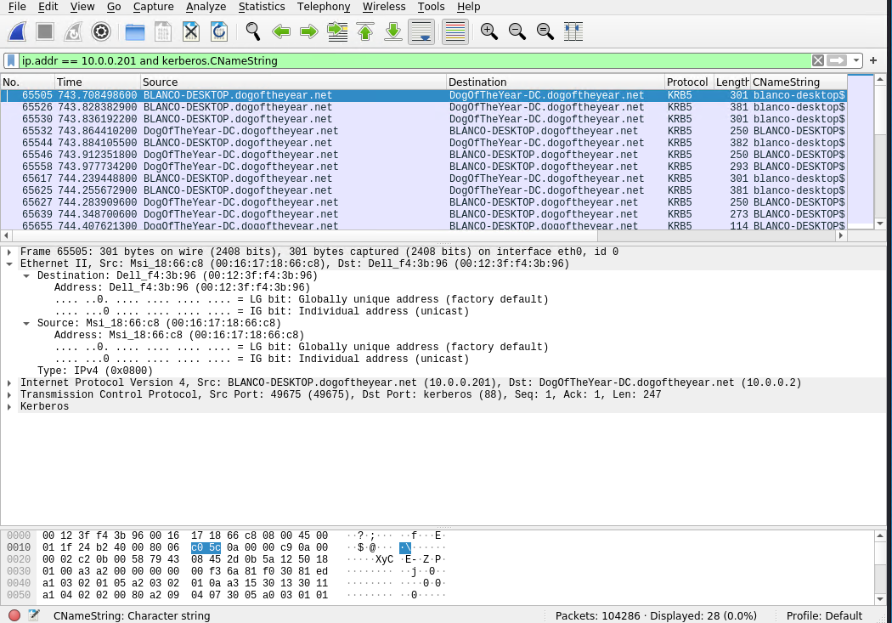

# Network Forensic Analysis Report

_TODO_ Complete this report as you complete the Network Activity on Day 3 of class.

## Time Thieves 
You must inspect your traffic capture to answer the following questions:

1. What is the domain name of the users' custom site?
The domain is frank-n-ted

2. What is the IP address of the Domain Controller (DC) of the AD network?

        - IP = 10.6.12.12

3. What is the name of the malware downloaded to the 10.6.12.203 machine?
        -   Malware File = June_11

Shows the GET header  request of the file

   
4. Result of file, exported  to Kali machine's desktop.

5. Kind of malware is this classified as.

        - The virus indicated from the file upload = Trojan.

---

## Vulnerable Windows Machine

1. The following information relates to the infected Windows machine:
    - Host name = Rotterdam_PC
    - IP address = 172.16.4.205
    - MAC address =00:59:07:d0:63:a4

2. The username of the Windows user of infected computer.

        - Name = matthijs.devries

3. The IP addresses used in infection traffic.

        - 172.16.4.205 - 185.243.115.84
        - 166.62.111.64 - 172.16.4.205

---

## Illegal Downloads

1. The following information relates to machine with IP address `10.0.0.201`:
    - MAC address = 00:16:17:18:66:c8
    - Windows username = blanco-destops
    - Computer host name = BLANCO-DESKTOPS

2. Torrent file, user download

    - File downloaded = Betty_Boop_Rhythm

