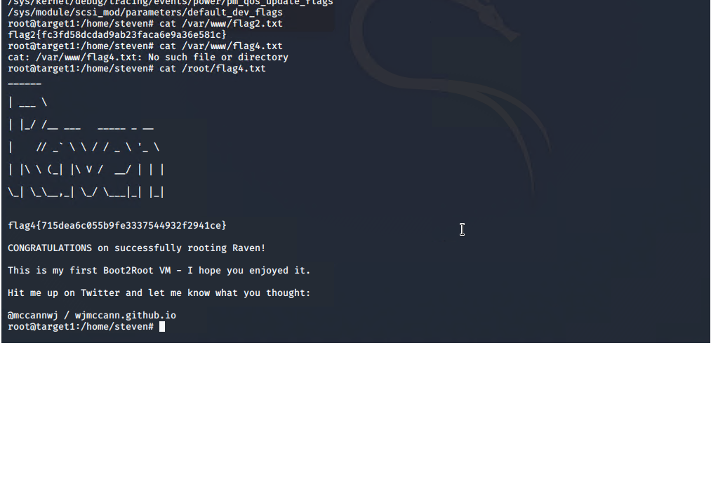

# Red Team: Summary of Operations

## Table of Contents
- Exposed Services
- Critical Vulnerabilities
- Exploitation

### Exposed Services

Nmap scan results for each machine reveal the below services and OS details:
```bash
$ nmap -vv -Pn -O 192.168.1.0/24
```


This scan identifies the services below as potential points of entry:
- Target 1 IP 192.168.1.110
  - List of  - Exposed Services    
      -Port 22 ssh
      -Port 80 http
      -Port 111 rpcbind
      -Port 139 netbios-ds
      -Port 445 microsoft

_TODO: Fill out the list below. Include severity, and CVE numbers, if possible.
The following vulnerabilities were identified on each target:
- Target 1 IP 192.168.1.110
  - List of Ccitical vulnerabilities
    -Password
    -HTTP service 
    -Wordpress 


_Scan results to prove the identified vulnerabilities._


### Exploitation


The Red Team was able to penetrate `Target 1` and retrieve the following confidential data:
- Target 1
  - `flag1.txt`:Refer to screen shot


    - **Exploit Used**
      - _HTTP Script
      - _Command Line_
      - _grep -ER *flags*

  - `flag2.txt`: Refer to screen shot
    - **Exploit Used**
      -Command line from root




      - _grep -ER *flags*
      - _cat /var/www/flag2.txt_