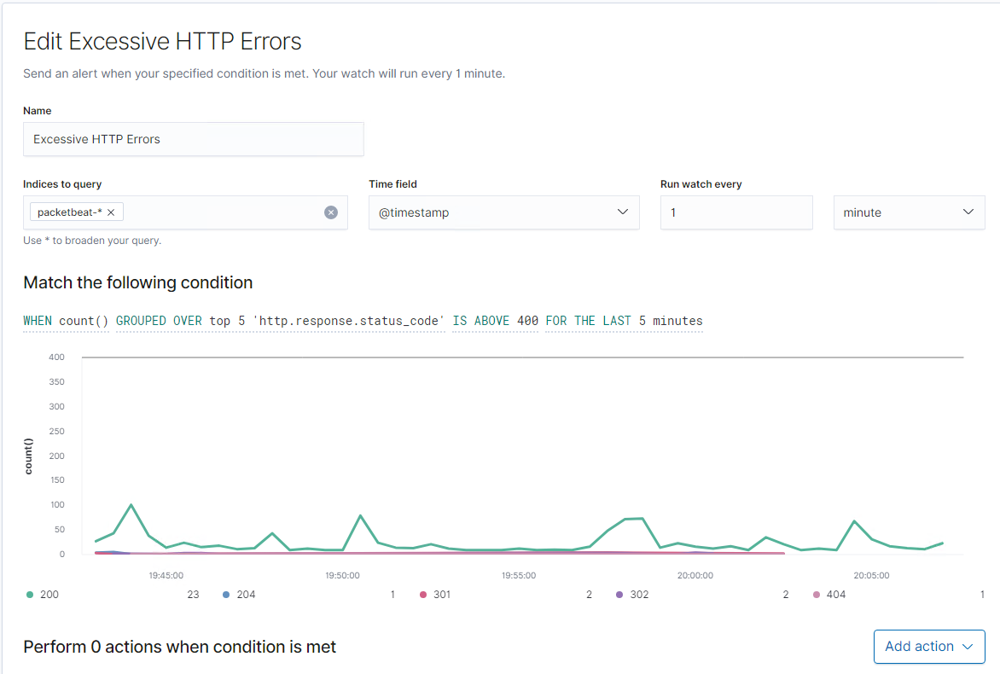
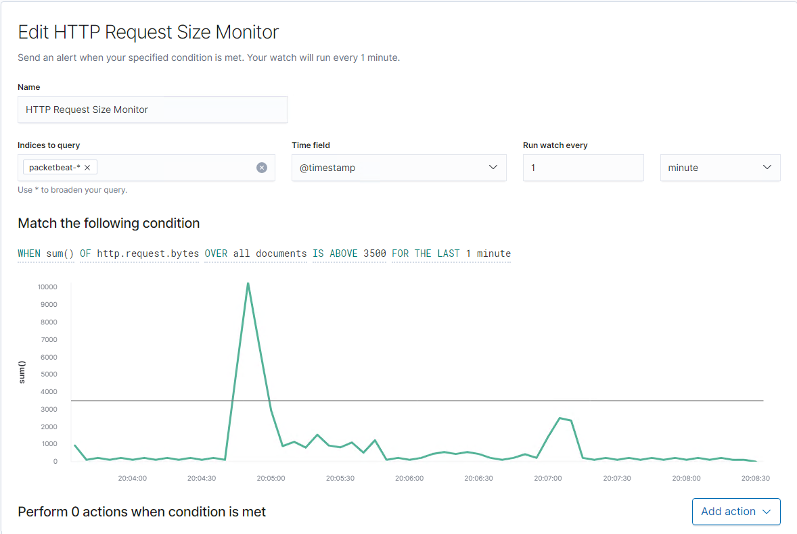

# Blue Team: Summary of Operations

## Table of Contents
- Network Topology
- Description of Targets
- Monitoring the Targets
- Patterns of Traffic & Behavior
- Suggestions for Going Further

### Network Topology
_TODO: Fill out the information below._

The following machines were identified on the network:
- Target 1
  - **Operating System**:Linux
  - **Purpose**:Test for vulnerability
  - **IP Address**:192.168.1.110

- Target 2
  - **Operating System**:Linux 
  - **Purpose**:Linux Test vulnerabilty
  - **IP Address**:192.168.115

 - Kail 3
    - **Operating System**:Linux
    - **Purpose**:Test for vunrabitiied 
    - **IP Address**:192.168.1.90
- Elk 
    - **Operating System**:Linux
    - **Purpose**:Server for for the different Operating Systems
    - **IP Address**:192.168.1.100

- Capstone 
    - **Operating System**:Linux
    - **Purpose**:To run alerts
    - **IP Address**:192.168.1.105

- Host
    - **Operating System**:Azure
    - **Purpose**:To run and store operating systems
    - **IP Address**:192.168.1.1

### Description of Targets
_TODO: Answer the questions below._

The target of this attack was: IP 192.168.1.110

Target 1 is an Apache web server and has SSH enabled, so ports 80 and 22 are possible ports of entry for attackers. As such, the following alerts have been implemented:

### Monitoring the Targets

Traffic to these services should be carefully monitored. To this end, we have implemented the alerts below:

Excessive HTTP Erros

Excessive HTTP Erros 
Alert 1 is implemented as follows:
  - **Metric**: Packetbeat
  - **Threshold**: 400
  - **Vulnerability Mitigated**:Degsin vulnerablities reduced by patches or by hiding the ports that are susceptiable
  - **Reliability**: This alert is indicating a pickup in HTTP requests

#### HTTP Rerquest Size Monitor
Alert 2 is implemented as follows:
  - **Metric**: Packetbeat
  - **Threshold**: 3500
  - **Vulnerability Mitigated**: Monitor the platforms that are linked to the system and also disable optimisations such as the importance of HTTP caching and application cache.
  - **Reliability**: The alert is recording a high number of counts related to HTTP requests the timing of the attackes coinside with other data captured at that time. Therefore the data has a high reliability

#### CPU Usage Monitor
Alert 3 is implemented as follows:
  - **Metric**: Metricbeat
  - **Threshold**: 1 record ever mintue
  - **Vulnerability Mitigated**: If there is high CPU useage, the impact could be realted to load balancer performamce this then indicates the again there is a correlation to HTTP request size. To mitigate CPU vulnerabilities, requires updates to operatiing systems and other systems for  software to firmware updates.
  - **Reliability**: By running the alert at 1 min intervals allows a link to servers there will be some false/positive as alert triggers will generate when there is limited time allocation to the duration of the data capture.

#