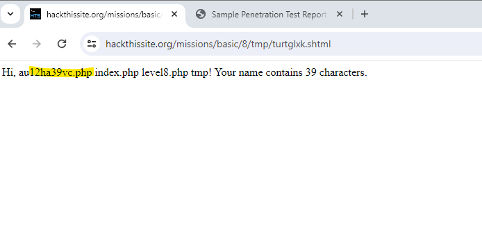
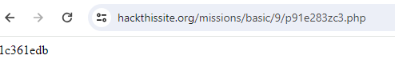

Executive Summary

This report was initiated by the client HTS to identify weakness within the customer side application and a number of structure/procedural issues found during the preliminary risk assessment. The report contains, detected poor methodology in both password protection and client-side access to the source code during the development of the application. The absence of best practice which will lead to vulnerability exploits by state, Insider threats and cyber criminals. Both ISO 27005 and 27001 were used to provide foundational structure to the penetration testing methodology.

Scope
Due to the continuous development of the applications and the potential exposure of the applications to potential threats, it was considered prudent to test the applications vulnerabilities. The initial phase was to identify any potential vulnerabilities around password storage/access, authentication and source code vulnerability. The identified concerns are used to build the report which includes mitigations recommendations to assist with the future stability and security of the platform from malicious actors. The table below identifies potential severity or likely hood of the explotation occuring.  

Action Taken
Level 1 (Password HTML) 
Action
Password identified within the web application source code which could indicate other sensitive information/notes could be available.

Recommendations
Before application is placed into a production environment the source code   should be scrubbed for any information that can identify sensitive information, from passwords, notes, txt files and other related development documentation of the application.

Level 2 (Password Scripting/ Brute Force) 
Action
Security of application related to poor password script application was identified. Due to the failure to upload the password file there was no requirement to meet any password requirements.

Recommendations
Improve password intricacy and length requirements, multi factor authentication and SHA-256 hashing algorithms.   

Level 3 (Password Scripting/ PHP file access)
Vulnerability 
Able to identify a readable file (php) in the front end of the application gain the password.

Recommendations
Secure readable files in directory via encryption that cannot be read by unauthorised users. 

Level 4 breach (HTML coding )
Vulnerability
Able to identify notes, email and redirect to assist with password access via the source code.

Recommendations
Remove hard code in HTML Java web applications use PHP as it is on the server side of the application and end users are unable to access it directly.

Level 5 breach (HTML tampering)
Vulnerability
The web application raw HTML code has information related to the user and is vulnerable to malicious actors who use the information for further.

Recommendations
The application should be scrub for any sensitive data on the client side. hard code sensitive information as client-side code as vulnerable to attack. Server side. To further protect passwords held in within a directory, the use of .htaccess  can assist with the protection of sensitive data. 

Level 6 (Cryptography)
Vulnerability
The password was encrypted using a type of Caesar cypher. In this case a group of letters, numbers and symbols was used.  The cypher complexity was then increased  with the codes first identifier being the same then each following identifier was increase by 1 and then incrementally increased. This type of encryption is very simplistic and easy for attackers to break and gain access to the application.

Recommendations
Use of modern encryption – 
Single Secret Key – encryption and decryption and the same key is shared between both the sender and receiver.
Hashing- using SHA-2 AES 256 (Advanced encryption standards)
The use of security password protection tool such as PageCrypt, or StatiCrypt.

Task 7 breach (Remote code execution)
Vulnerability
User can access a file contain data in this case the password to access the system using the special characters semi-colon which are used to in code command lines. The attacker can brute force this vulnerability and access sensitive file and or command lines in the server.

Recommendations
Sanitisation of identifiable items such as cookies 
Remove direct injection type commands from the user input form.
Use of Firewalls to stop SQL injections 

Task 8 (web form security/SSI injection)
Vulnerability
The use of the following command <!--#exec cmd="ls ../" --> within the application sign-in form allows malicious actors access to the server side of the application.

Recommendations
Clean treat untrusted data
To assist refer to OWASP for further advice (https://owasp.org/www-project-top-ten/)

Task 9 (Script; server-side attack)
Vulnerability
The attacker was able to move through the directories to obtain access to the server the following script was executed on through server 8 <!--#exec cmd="ls ../../9" --> to gain the hard coded password for serve 9 via a .php file.

Recommendations
To ensure that user input is sanitised and the removal of hard coded password in .php files

Task 10 (Java Script)
Vulnerability
The malicious actor was able to access to the application via the web dev ops tool and hijack the session cookie that related to the login session as the login session had not been cleared.

Recommendations
Ensure that cookies are cleared after the browser is closed. Maintain naming conventions that do not reflect the actual use of the session and ensure there is encryption of the session.
Maintain control accessing a session by ensuring that login details are authenticated before the user receives a session (cookie) 

Task 11 ( Directory Listing)
Vulnerability
 The login form and password although hidden from direct access were still accessible on the user side of the application. 

Recommendations
The Directory listing should not be enabled and password authentication should be in the main server activity file.

  Conclusion

During the investigation, activities were conducted to test the security of password structure and it was found that there were numerous procedural issues lacking industry standards.  There website contain vulnerabilities related to Hypertext markup language (HTML) source code via the user end of the application. It is suggested that training enforcement of coding and security procedures be conducted.

  